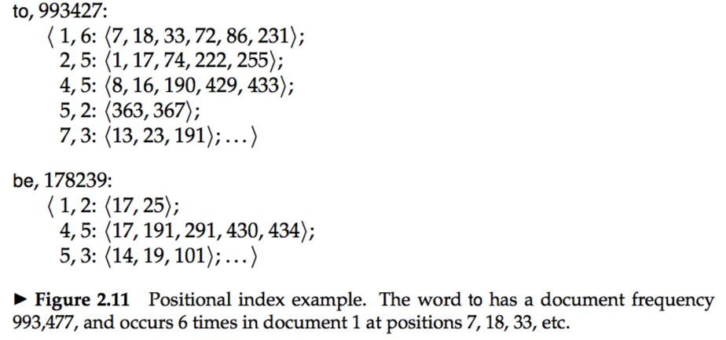



# 2.1 Document delineation and character sequence decoding
### 2.1.1 Obtaining the character sequence in a document
* Convert the byte sequence into a linear sequence of characters(e.g., unicode to ASCII).  
&emsp;	* machine learning classification  
&emsp;	* heuristic methods  
&emsp;	* user selection  
&emsp;	* document metadata  

### 2.1.2 Choosing a document unit
* The issue of index granularity needs paying more attention.  

# 2.2 Determining the vocabulary of terms
### 2.2.1 Tokenization  
*token* : A token is an instance of a sequence of characters in some particular document that are grouped together as a useful semantic unit for processing  
*type* : A type is the class of all tokens containing the same character sequence  
*term* : A term is a (perhaps normalized) type that is included in the IR system’s dictionary  
**e.g.** `to sleep perchance to dream`includes 5 tokens,4 types, 3 terms.    
*language identification* : Identify language based on machine learning classifiers.  
* One solution is to encourage users to input over-eager and search for `over-eager` or `over eager`.  
&emsp;	* hyphenation : Hyphens needs paying attention.  
&emsp;	* white space : Sometimes white space splits what should be regarded as a single token, e.g.,`New York`.  
  
### 2.2.2 Dropping common terms: stop words  
*stop words* Some common words which are of little value in helping select documents.    
* Some stop words may be useful, **e.g.**,`flights to London` means nothing without `to`.   
* Modern IR systems tend to ignore stop words gradually.
  
### 2.2.3 Normalization (equivalence classing of terms) 
*token normalization* : Canonicalize tokens so that matches occur despite superficial differences in the character sequences of the tokens.  
*equivalence classes* : Different format of the same token.  
* two ways of normalization in IR  
&emsp; 1. Maintain a query expansion list of multiple vocabulary entries for a certain query term  
&emsp; 2. Perform the expansion during index construction, e.g., index `automobile` under `car` as well    
* Commonly employed normalization forms.  
&emsp; 1. Accents and diacritics  
&emsp; 2. Capitalization/case-folding(*truecasing* : uses more features to make the decision of when to case-fold)  
&emsp; 3. Other issues in English  
&emsp; 4. Other languages  

### 2.2.4 Stemming and lemmatization  
*stemming* : Base on language-specific rules. e.g.,`saw` to `s`.  
*lemma* : Base on a complete vocabulary, morphological analysis and domain knowledge. e.g.,`saw` to `see` or `saw`.  
*Porter's algorithm* : The most common algorithm for stemming English（others: Lovins stemmer, Paice stemmer）.  
* Either form of normalization tends not to improve English IR performance in aggregate, but the situation is different for languages with much more morphology (such as Spanish, German, and Finnish).  

# 2.3 Faster postings list intersection via skip pointers

* For skip pointers, we use √P evenly-spaced skip pointers for a postings list of length P.  

# 2.4 Positional postings and phrase queries  
### 2.4.1 Biword indexes
* Consider every pair of consecutive terms in a document as a phrase.  
* Sometimes the noun phrases have a special status, e.g., `the abolition of slavery`, which needs performing part-of-speech-tagging to be `slavery abolition`.  
* Transform the noun phrases into biword doesn't always work.e.g., `cost overruns on a power plant` to `“cost overruns” AND “overruns power” AND “power plant”`.  
*part-of-speech-tagging* : Part of speech taggers classify words as nouns, verbs, etc.   

### 2.4.2 Positional indexes

* The method is applied for within k word proximity searches. 
  
### 2.4.3 Combination schemes
* Combine the strategies of biword indexes and positional indexes.  
 
# 2.5 References and further reading
* Character bigram indexes are perhaps the most standard approach to indexing Chinese, although some systems use word segmentation.  
* Papers about what is discussed before.

