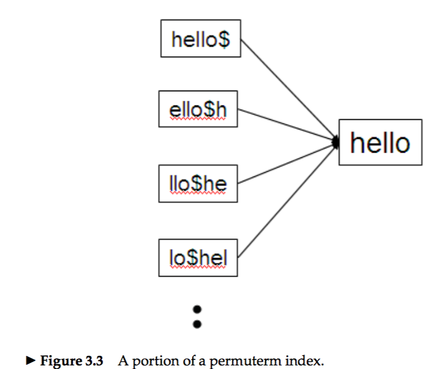
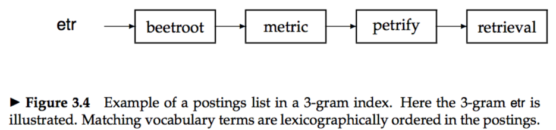
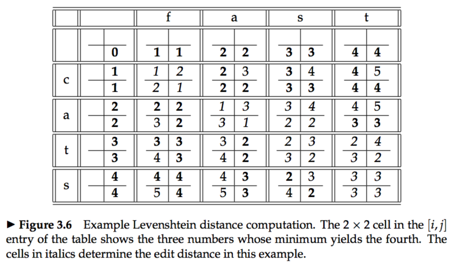



# 3.1 Search structures for dictionaries
* Two solutions for dictionaries : hashing, and search trees.  
* Hash   
There is no easy way to find minor variants of a query term , since these could be hashed to very different integers;  
In a setting where the vocabulary size keeps growing, a hash function designed for current needs may not suffice in a few years’ time.  
* Search tree : binary tree, B-tree  

# 3.2 Wildcard queries
* Using a regular B-tree(**e.g.**, for `mon*`) together with a reverse B-tree(**e.g.**, for `*mon`), we can handle an even more general case, **e.g.**, `se*mon`  

### 3.2.1 General wildcard queries
#### Permuterm indexes

* **e.g.**, when the query is `fi*mo*er`, we first enumerate the terms inn the permuterm index of `er$fi*`, then filter out what doesn't have the string `mo` in the middle.  
* Disadvantage: the dictionary is quite large.  

### 3.2.2 k-gram indexes for wildcard queries
* **e.g.**, the full set of 3-grams generated for castle is: $ca, cas, ast, stl, tle, le$.  

* **e.g.**, `re*ve` equals to `$re AND ve$`  
* *post-filtering:* **e.g.**, for `red*`, the query `$re AND red` leads to `retired`, so the terms enumerated by the Boolean query on the 3-gram index should be checked against `red*` first.  
* The processing of a wildcard query is quite expensive.  

# 3.3 Spelling correction
### 3.3.1 Implementing spelling correction
* Basic principles :  
&emsp; 1. Of various alternative correct spellings for a mis-spelled query, choose the “nearest” one.   
&emsp; 2. When two correctly spelled queries are tied (or nearly tied), select the one that is more common.  

### 3.3.2 Forms of spelling correction
1. isolated-term correction (**e.g.**, `carot` to `carrot`)   
2. context-sensitive correction (**e.g.**, `flew form Heathrow` to `flew from Heathrow`)  

### 3.3.3 Edit distance
* *edit distance:* Given two character strings s1 and s2, the edit distance between them is the minimum number of edit operations required to transform s1 into s2, including insert, delete and replace.  
* Algorithm: Dynamic programming algorithm for computing the edit distance(Levenshtein distance)  
 
* Given a set S of strings (corresponding to terms in the vocab- ulary) and a query string q, we seek the string(s) in V of least edit distance from q.  
**heuristic：** spelling errors do not occur in the first character of the query.  

### 3.3.4 k-gram indexes for spelling correction
* **e.g.,** `bord` can be divided into `bo`,`or`,`rd`, and matchs `aboard`, `boardroom` with `2-gram` index. 
* `boardroom` is a implausible correction of `bord`, so we need *Jaccard coefficient* (or other measures) for measuring the over- lap between two sets.  
*  *Jaccard coefficient*: |A ∩ B|/|A ∪ B|.  
c**e.g.**, A = bord, B = boardroom, the Jaccard coefficient is 2/(8 + 3 − 2). (`2` means `bo` and `rd`)  

### 3.3.5 Context sensitive spelling correction
 * **e.g.**, `flew form Heathrow` should be corrected to `flew from Heathrow`  
 * Enumerate corrections (using the methods leading up to Section 3.3.4) even though each query term is correctly spelled, and choose the most appropriate one.  
 * **heuristic：** 
 &emsp; 1. Retain only the most frequent combinations in the collection or in the query logs.
 &emsp; 2. Only attempt to extend the list of top biwords.  
 
# 3.4 Phonetic correction
* *soundex algorithms：* The main idea here is to generate, for each term, a “phonetic hash” so that similar-sounding terms hash to the same value.   

