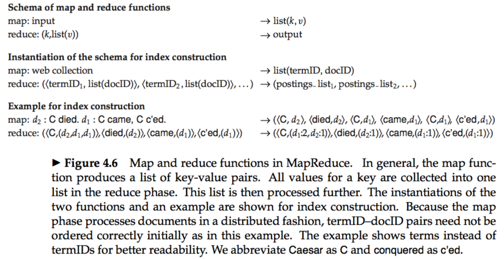


# Index Construction
### 4.1 Hardware basics
* *cacheing:* The technique of keeping frequently used disk data in main memory is called `caching`.   
* *seek time:* The time which the disk head takes to move to the part of the disk where the data are located.  
* *buffer:* The part of main memory where a block being read or written is stored is called a `buffer`.  
* The processor is available to process data during disk I/O, so we can speed up data transfers by storing compressed data on disk.  

### 4.2 Blocked sort-based indexing
* Represent terms as `termIDs` (instead of strings), where each termID is a unique serial number.  
* *external sorting algorithm:* With main memory insufficient, one that uses disk.  
* *blocked sort-based indexing algorithm or BSBI:* 
&emsp; 1.segments the collection into parts of equal size  
&emsp; 2.sorts the termID–docID pairs of each part in memory  
&emsp; 3.stores intermediate sorted results on disk  
&emsp; 4.merges all intermediate results into the final index  
* *BSBI time complexity:* Θ(T*logT)  

### 4.3 Single-pass in-memory indexing
* *single-pass in-memory indexing or SPIMI:*  SPIMI uses terms instead of termIDs, writes each block’s dictionary to disk, and then starts a new dictionary for the next block.  
&emsp; * Each postings list is dynamic. We allocate space for a short postings list initially and double the space each time it is full.  
&emsp; * It is faster because there is no sorting required.  
* *BSBI time complexity:* Θ(T)   

### 4.4 Distributed indexing
* *MapReduce:* A general architecture for distributed computing

### 4.5 Dynamic indexing
* Most collections are modified frequently with documents being added, deleted, and updated, which means postings lists need to be updated.  
* One solution is to maintain two indexes: a large main index and a small auxiliary index that stores new documents. The auxiliary index is kept in memory.    
* Because of this complexity of dynamic indexing, some large search engines adopt a reconstruction-from-scratch strategy.  

### 4.6 Other types of indexes
* In a docID-sorted index, new documents are always inserted at the end of postings lists. In an impact-sorted index, the insertion can occur anywhere, thus complicating the update of the inverted index.  
* Securityis an important consideration for retrieval systems in corporations.
* *access control lists or ACLs:* ACLs can be dealt with in an IR system by representing each document as the set of users that can access them 
