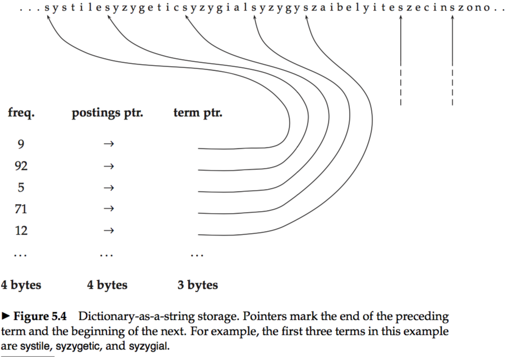
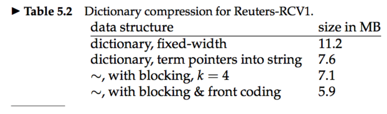



* Two benefits of compression:  
&emsp; * Increased use of caching.
&emsp; * Faster transfer of data from disk to memory.  

# Statistical properties of terms in information retrieval
* Preprocessing (case folding, stemming, and stop word elimination) affects the size of the dictionary and the number of nonpositional postings greatly.  

### 5.1.1 Heaps’ law: Estimating the number of terms
* *Heaps' law:* Estimates vocabulary size as a function of collection size: M = kT(b). T is the number of tokens in the collection. Typical values for the parameters k and b are: 30 ≤ k ≤ 100 and b ≈ 0.5.  

### 5.1.2 Zipf’s law: Modeling the distribution of terms
* *Zipf's law:* A commonly used model of the distribution of terms in a collection.  
* If the most frequent term occurs cf1 times, then the second most frequent term has half as many occurrences, the third most frequent term a third as many occurrences, and so on.  

# 5.2 Dictionary compression
### 5.2.1 Dictionary as a string
* Using fixed-width entries for terms is clearly wasteful. We can overcome these shortcomings by storing the dictionary terms as one long string of characters.  

### 5.2.2 Blocked storage
* We can further compress the dictionary by grouping terms in the string into blocks of size k and keeping a term pointer only for the first term of each block.  

&emsp; * There is a tradeoff between compression and the speed of term lookup.  
* *Front coding:* Consecutive entries in an alphabetically sorted list which share common prefixes can be compressed.  

# 5.3 Postings file compression
* The `gaps` between postings are short, requiring a lot less space than the normal representation of the postings file.  
* **e.g.:** We will find a document containing computer, then we skip a few documents that do not contain it, then there is again a document with the term and so on. But the gaps for a rare term that occurs only once or twice in a collection (e.g., arachnocentric) have the same order of magnitude as the docIDs.   

### 5.3.1 Variable byte codes
* *Variable byte (VB) encoding:* Uses an integral number of bytes to encode a gap.  

### 5.3.2 γ codes
`（skipped for now）`
