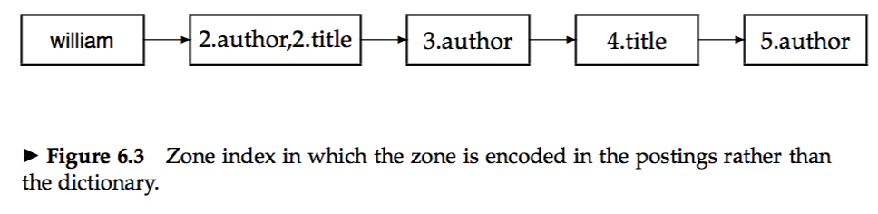
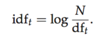
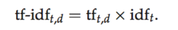
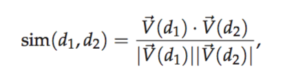
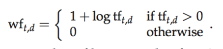
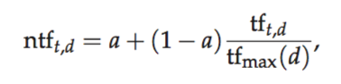
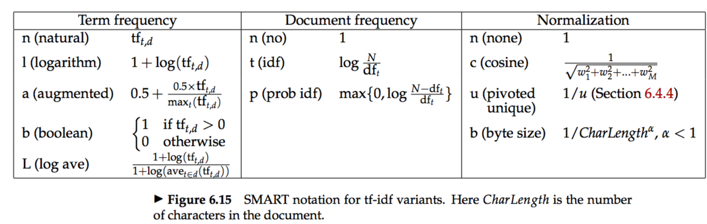



# 6.1 Parametric and zone indexes
* *parametric indexes:* There is one parametric index for each field (say, author and date of creation).  
* *zones:* Zones are similar to fields, except the contents of a zone can be arbitrary free text. **e.g.,** document titles and abstracts.   
* Encoding the zone in which a term occurs in the postings.  

### 6.1.1 Weighted zone scoring
* Weighted zone scoring is sometimes referred to also as ranked Boolean retrieval.  
* Given a Boolean query q and a document d, weighted zone scoring assigns to the pair (q, d) a score in the interval [0, 1], by computing a linear combination of zone scores, where each zone of the document contributes a Boolean value.  

### 6.1.2 Learning weights
### 6.1.3 The optimal weight g
* With the help of machine learning.

# 6.2 Term frequency and weighting
* *term frequency:* Assign the weight to be equal to the number of occurrences of term t in document d.  
* *bag of words:* The exact ordering of the terms in a document is ignored but the number of occurrences of each term is material.  

### 6.2.1 Inverse document frequency
* *document frequency:* the number of documents in the collection that contain a term t.  
* *inverse document frequency (idf)：* 

### 6.2.2 Tf-idf weighting

1. Highest when t occurs many times within a small number of documents.  
2. Lower when the term occurs fewer times in a document,or occurs in many documents.  
3. Lowest when the term occurs in virtually all documents.  

# 6.3 The vector space model for scoring
* *vector space model(VSM):* Represent a set of documents as vectors in a common vector space.  

### 6.3.1 Dot products
* *cosine similarity:*  
  
*  We reduce the problem of finding the document(s) most similar to `d` to that of finding the `di` with the highest dot products.  

### 6.3.2 Queries as vectors
* We can also view a query as a vector.

### 6.3.3 Computing vector scores
* Store `N/df` at the head of the postings for the term.  
* Store the term frequency tf for each postings entry.  

# 6.4 Variant tf-idf functions
### 6.4.1 Sublinear tf scaling
  

### 6.4.2 Maximum tf normalization
 

### 6.4.3 Document and query weighting schemes
  
* The mnemonic for representing a combination of weights takes the form ddd.qqq where the first triplet gives the term weighting of the document vector, while the second triplet gives the weighting in the query vector.  

### 6.4.4 Pivoted normalized document length
* Longer documents can broadly be lumped into two categories:  
&emsp; 1. Verbose documents that essentially repeat the same content.  
&emsp; 2. Documents covering multiple different topics, in which the search terms probably match small segments of the document but not all of it.   
* Relevance may have something to do with document length, so we need `Pivoted normalized document length(NOT SURE!)`.  
* When we compute the dot product score between a (unit) query vector and such a normalized document, the score is skewed to account for the effect of document length on relevance.  
`(skipped for now!)`  
