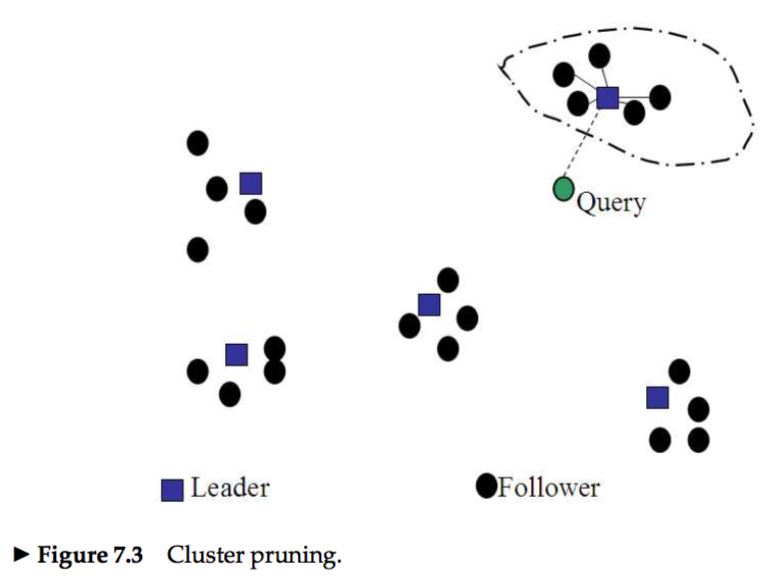
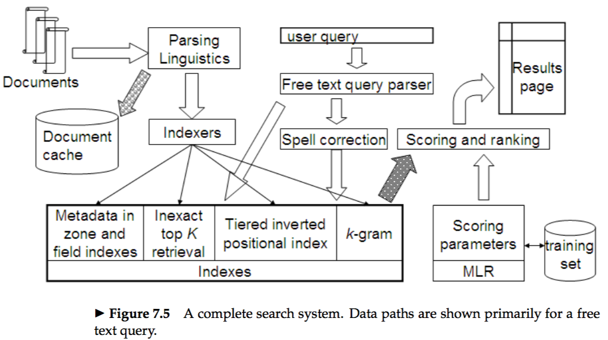



# 7.1 Efficient scoring and ranking
* All non-zero components of the query vector can be set to 1 ranther than to the unit vector.  

### 7.1.1 Inexact top K document retrieval
* Consider schemes by which we produce K documents that are likely to be among the K highest scoring documents for a query.  
* The heuristics with the two-step scheme:  
&emsp; 1.Find a set A of documents that are contenders, where K < |A| ≪ N.  
&emsp; 2.Return the K top-scoring documents in A.

### 7.1.2 Index elimination
* We only consider documents containing terms whose idf exceeds a preset threshold.  
* We only consider documents that contain many (and as a special case, all) of the query terms.  

### 7.1.3 Champion lists
* *champion lists:* Precompute, for each term t in the dictionary, the set of the r documents with the highest weights for t.  

### 7.1.4 Static quality scores and ordering
* *static quality scores:* In many search engines, we have available a measure of quality g(d) for each document d that is query-independent and thus static.  
* The net score for a document d is some combination of g(d) together with the query-dependent score.  
* At query time, we only compute the net scores for documents in the union of global champion lists of each term.  

### 7.1.5 Impact ordering
* A technique for inexact top-K retrieval in which the postings are not all ordered by a common ordering, thereby precluding a concurrent traversal.  
* Given postings lists ordered by decreasing order of `tf`:
&emsp; 1.when traversing the postings list for a query term t, we stop after considering a prefix of the postings list – either after a fixed number of documents r have been seen, or after the value of `tf` has dropped below a threshold;  
&emsp; 2.Consider the query terms in decreasing order of `idf`, so that the query terms likely to contribute the most to the final scores are considered first.  

### 7.1.6 Cluster pruning
* In cluster pruning, we cluster the document vectors. Then at query time, we consider only documents in a small number of clusters as candidates.  

# 7.2 Components of an information retrieval system
### 7.2.1 Tiered indexes
* If we set a `tf` threshold of 20 for `tier` 1, it means that the `tier` 1 index only has postings entries with `tf` values exceeding 20.  

### 7.2.2 Query-term proximity
* **e.g.:**If the document were to simply consist of the sentence `The quality of mercy is not strained`, the smallest window for the query `strained mercy` would be 4.  
* The smaller the smallest window is, the better the document matches the query.  

### 7.2.3 Designing parsing and scoring functions
* **e.g.:** Query `rising interest rates`  
&emsp; 1.Query the vector consisting of the 3 terms rising interest rates.  
&emsp; 2.If fewer than ten documents contain the phrase rising interest rates, run the two 2-term phrase queries rising interest and interest rates; rank these using vector space scoring, as well.  
&emsp; 3.If we still have fewer than ten results, run the vector space query consist- ing of the three individual query terms.  
Each of these steps (if invoked) may yield a list of scored documents, for each of which we compute a score. This score must combine contributions from vector space scoring, static quality, proximity weighting and potentially other factors.

### 7.2.4 Putting it all together

# Vector space scoring and query operator interaction
* This chapter discuss how the vector space scoring model relates to the query operators we have studied in earlier chapters.  
