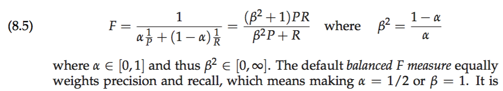
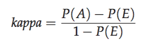
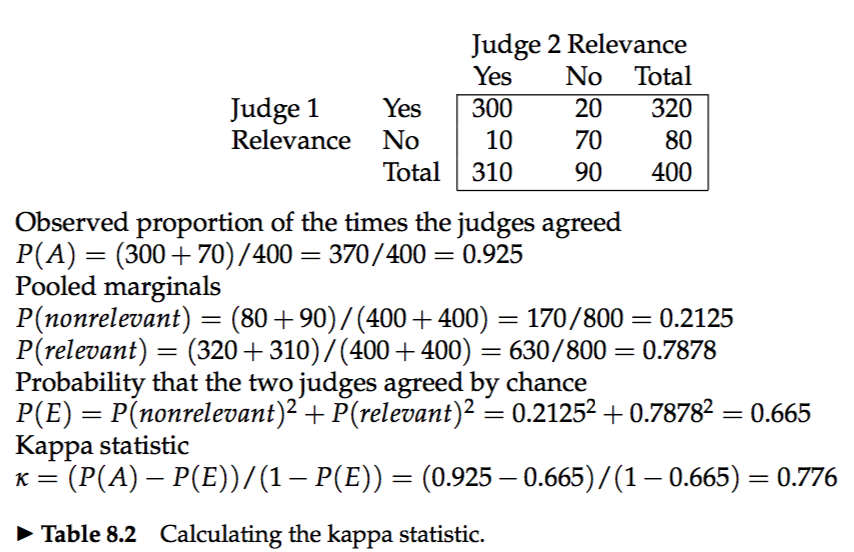



# 8.1 Information retrieval system evaluation
* **relevance,information need:** Relevance is assessed relative to an information need, not a query.**e.g.,** `Information on whether drinking red wine is more effective at reducing your risk of heart attacks than white wine.`, which might be translated into a query such as `wine AND red AND white AND heart AND attack AND effective`.  
* The correct procedure is to have one or more development test collections, and to tune the parameters on the development test collection.  

# 8.2 Standard test collections
* CRANFIELD, TREC, GOV2, NTCIR, CLEF, REUTERS, NEWSGROUPS  

# 8.3 Evaluation of unranked retrieval sets
* The two most frequent and basic measures for information retrieval effectiveness are `precision` and `recall`.  
* `accuracy` = (tp + tn)/(tp + fp + fn + tn). accuracy is not an appropriate measure, for a system tuned to maximize accuracy can appear to perform well by simply deeming all documents nonrelevant to all queries.  
* `F measure`  

# 8.4 Evaluation of ranked retrieval results
* precision-recall curve  
* 11-point interpolated average precision  
* Mean Average Precision (MAP)  
.......  
`skipped for now`  

# 8.5 Assessing relevance
* **pooling:** Relevance is assessed over a subset of the collection that is formed from the top k documents returned by a number of different IR systems.  
* * **kappa statistic:** It's for categorical judgments and corrects a simple agreement rate for the rate of chance agreement.  

* As a rule of thumb, a kappa value above 0.8 is taken as good agree- ment, a kappa value between 0.67 and 0.8 is taken as fair agreement, and agreement below 0.67 is seen as data providing a dubious basis for an evalu- ation.  

### 8.5.1 Critiques and justifications of the concept of relevance
* **marginal relevance:** Whether a document still has distinctive usefulness after the user has looked at certain other documents.  

# 8.6 A broader perspective: System quality and user utility
### 8.6.1 System issues
* Some benchmarks on which to rate an information retrieval system beyond its retrieval quality.  

### 8.6.2 User utility
* We need to decide whether it is the end user’s or the eCommerce site owner’s happiness that we are trying to optimize.  
* User studies are very useful in system design, but they are time consuming and expensive to do.  

### 8.6.3 Refining a deployed system
* **A/B testing:** One thing is changed between the current system and a proposed system, and a small proportion of traffic (say, 1–10% of users) is randomly directed to the variant system, while most users use the current system.   

# 8.7 Results snippets
* **snippet:** The snippet consists of the document title and a short summary, which is automatically extracted.  
* **static summary:** The results are always the same regardless of the query.  
* **dynamic summary:** Dynamic summaries attempt to explain why a particular document was retrieved for the query at hand.   
