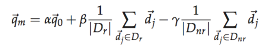



* The methods for tackling `synonymy` problem split into two major classes: global methods and local methods.  
* **global methods:** Global methods are techniques for expanding or reformulating query terms independent of the query and results returned from it.  
*  **local methods:** Local methods adjust a query relative to the documents that initially appear to match the query.  

# 9.1 Relevance feedback and pseudo relevance feedback
* **relevance feedback (RF):** The user gives feedback on the relevance of documents in an initial set of results to improve the final result set.  

### 9.1.1 The Rocchio algorithm for relevance feedback
* **Rocchio underlying theory:** The optimal query is the vector difference between the centroids of the relevant and nonrelevant documents.  
* **Rocchio Algorithm:**  
  
Reasonable values might be α = 1, β = 0.75, and γ = 0.15.

### 9.1.2 Probabilistic relevance feedback
* Naive Bayes probabilistic model

### 9.1.3 When does relevance feedback work?
* The user has to make an initial query close to the documents they want.  
&emsp; 1.Misspellings.  
&emsp; 2.Cross-language information retrieval.  
&emsp; 3.Mismatch of searcher’s vocabulary versus collection vocabulary.  
* The relevance feedback approach requires relevant documents to be similar to each other.   
&emsp; 1.Subsets of the documents using different vocabulary, such as Burma vs. Myanmar.  
&emsp; 2.A query for which the answer set is inherently disjunctive, such as Pop stars who once worked at Burger King.  
&emsp; 3.Instances of a general concept, which often appear as a disjunction of more specific concepts, for example, felines.  

### 9.1.4 Relevance feedback on the web
* Excite search engine provides full relevance feedback.  
* Relevance feedback is hard to explain to the average user, and relevance feedback is mainly a recall enhancing strategy, and web search users are rarely concerned with recall.  
* Another way is the use of clickstream data (what links a user clicks on) to provide indirect relevance feedback.  

### 9.1.5 Evaluation of relevance feedback strategies
* precision-recall graph.  
* **residual collection:** The set of documents minus those assessed relevant.  
* The best evaluation of relevance feedback is to do user studies of its effectiveness, in particular by doing a time-based comparison.  

### 9.1.6 Pseudo relevance feedback
* **Pseudo relevance feedback(blind relevance feedback):** The method is to do normal retrieval to find an initial set of most relevant documents, to then assume that the top k ranked documents are relevant, and finally to do relevance feedback as before under this assumption.  
* it is not without the dangers of an automatic process. **e.g.,** if the query is about `copper mines` and the top several documents are all about mines in Chile, then there may be query drift in the direction of documents on Chile.  

### 9.1.7 Indirect relevance feedback
* **clickstream mining:** Clicks on links were assumed to indicate that the page is likely relevant to the query.  

### 9.1.8 Summary
1.The core ad hoc retrieval scenario.    
2.Following a changing information need.  
3.Maintaining an information filter.  
4.Active learning.  
 
# 9.2 Global methods for query reformulation
### 9.2.1 Vocabulary tools for query reformulation
* The IR system might suggest search terms by means of a thesaurus or a controlled vocabulary.  

### 9.2.2 Query expansion
* Users give additional input on query words or phrases, possibly suggesting additional query terms.  
* Methods for building a thesaurus for query expansion include:
&emsp; 1.Use of a controlled vocabulary that is maintained by human editors.  
&emsp; 2.A manual thesaurus.  
&emsp; 3.An automatically derived thesaurus.  
&emsp; 4.Query reformulations based on query log mining.  

### 9.2.3 Automatic thesaurus generation
* Two main approaches:  
&emsp; 1.exploit word cooccurrence.  
&emsp; 2.use a shallow grammatical analysis of the text and to exploit grammatical relations or grammatical dependencies.  
* In general a domain-specific thesaurus is required.  
* Overall, query expansion is less successful than relevance feedback, though it may be as good as pseudo relevance feedback.  

