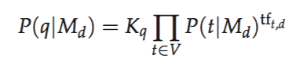
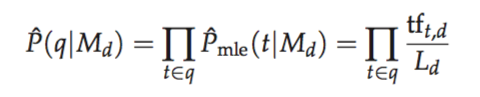


# 12.1 Language models
### 12.1.1 Finite automata and language models
* **generative model:** Used either to recognize or to generate strings.  
* **language model:** A language model is a function that puts a probability measure over strings drawn from some vocabulary.  

### 12.1.2 Types of language models
* unigram language model (bag of words), bigram
language models and so on.  

### 12.1.3 Multinomial distributions over words
* The strategy we adopt in IR is as follows. We pretend that the document d is only a representative sample of text drawn from a model distribution, treating it like a fine-grained topic. We then estimate a language model from this sample, and use that model to calculate the probability of observing any word sequence, and, finally, we rank documents according to their probability of generating the query.  

# 12.2 The query likelihood model
### 12.2.1 Using query likelihood language models in IR
* **query likelihood model:** Documents are ranked by the probability that a query would be observed as a random sample from the respective document model.   
   
* The most common way to do this is using the multinomial unigram language model, which is equivalent to a multinomial Naive Bayes model.   

### 12.2.2 Estimating the query generation probability
  
* something about approaches to smoothing probability distributions.  
`skipped for now`  

### 12.2.3 Ponte and Croft’s Experiments
* The language modeling approach always does better than tf-idf in these experiments, but note that where the approach shows significant gains is at higher levels of recall.  

# 12.4 Extended language modeling approaches
* **document likelihood model:** The probability of a query language model Mq generating the document.  
* **Kullback-Leibler (KL) divergence:** One way to model the risk of returning a document d as relevant to a query q is to use the Kullback-Leibler (KL) divergence between their respective language models.  
* **translation model:** Let you generate query words not in a document by translation to alternate terms with similar meaning.  

