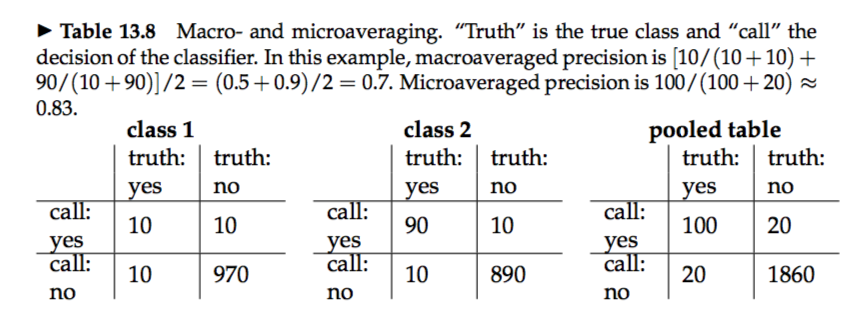



* **standing queries:** A standing query is like any other query except that it is periodically executed on a collection to which new documents are incrementally added over time.  
* The classification task is called text classification, text categorization, topic classification, or topic spotting.  
* **Topic-specific or vertical search:** Vertical search engines restrict searches to a particular topic. **e.g.,** the query `computer science` on a vertical search engine for the topic `China` will return a list of Chinese computer science departments with higher precision and recall than the query `computer science China` on a general purpose search engine.   
* Apart from manual classification and hand-crafted rules, there is a third approach to text classification, namely, machine learning-based text classification.  

# 13.1 The text classification problem
* The classes in text classification often have some interesting structure such as the hierarchy.  
* Sometimes a document belongs to more than one class.  

# 13.2 Naive Bayes text classification
* **maximum a posteriori (MAP):** 
  
* To eliminate zeros, we use add-one or Laplace smoothing, which simply adds one to each count:  
  

### 13.2.1 Relation to multinomial unigram language model
  

# 13.3 The Bernoulli model
* There are two different ways we can set up an NB classifier: `multinomial model` and `multivariate Bernoulli model (Bernoulli model)`  
* When classifying a test document, the Bernoulli model uses binary occurrence information, ignoring the number of occurrences, whereas the multinomial model keeps track of multiple occurrences.   
* As a result, the Bernoulli model typically makes many mistakes when classifying long documents. For example, it may assign an entire book to the class China because of a single occurrence of the term China. 
   
  
  

# 13.4 Properties of Naive Bayes
* two important assumptions: conditional independence assumption, positional independence assumption.  
  
* Even though the probability estimates of NB are of low quality, its classification decisions are surprisingly good.   
* Correct estimation implies accurate prediction, but accurate prediction does not imply correct estimation. NB classifiers estimate badly, but often classify well.    
* NB’s main strength is its efficiency: Training and classification can be ac- complished with one pass over the data.   
* Because it combines efficiency with good accuracy it is often used as a baseline in text classification research.  

### 13.4.1 A variant of the multinomial model
  

# 13.5 Feature selection
* **feature selection:** Feature selection is the process of selecting a subset of the terms occurring in the training set and using only this subset as features in text classification.  
&emsp; 1.it makes training and applying a classifier more efficient by decreasing the size of the effective vocabulary.  
&emsp; 2.increases classification accuracy by eliminating noise features.  

### 13.5.1 Mutual information
  
  

### 13.5.2 χ2 Feature selection
* **χ2 test:**  In statistics, the χ2 test is applied to test the independence of two events, where two events A and B are defined to be independent if P(AB) = P(A)P(B) or, equivalently, P(A|B) = P(A) and P(B|A) = P(B).  
 
* A high value of X2 indicates that the hypothesis of independence, which implies that expected and observed counts are similar, is incorrect.  
  

### 13.5.3 Frequency-based feature selection
* Figure 13.8 is a case where frequency-based feature selection performs a lot worse than MI and χ2 and should not be used.  

### 13.5.4 Feature selection for multiple classifiers
* In an operational system with a large number of classifiers, it is desirable to select a single set of features instead of a different one for each classifier.   

### 13.5.5 Comparison of feature selection methods
* Mutual information and χ2 represent rather different feature selection methods.  
* In most text classification problems, there are a few strong indicators and many weak indicators. As long as all strong indicators and a large number of weak indicators are selected, accuracy is expected to be good.   
* All three methods – MI, χ2 and frequency based – are greedy methods. Although such redundancy can negatively impact accuracy, non-greedy methods are rarely used in text classification due to their computational cost.  

# 13.6 Evaluation of text classification
* Historically, the classic `Reuters-21578` collection was the main benchmark for text classification evaluation.  
* `ModApte split`, includes only documents that were viewed and assessed by a human indexer, and comprises 9,603 training documents and 3,299 test documents.   
* This measure（`accuracy`） is appropriate if the percentage of documents in the class is high, perhaps 10% to 20% and higher.  
* For small classes, precision, recall and F1 are better measures.  
* **effectiveness:** a generic term for measures that evaluate the quality of classification decisions, including precision, recall, F1, and accuracy.   
* **performance:** the computational efficiency of classification.  
&emsp; * However, many researchers mean effectiveness, not efficiency of text classification when they use the term performance.  
* `Macroaveraging` computes a simple average over classes. `Microaveraging` pools per-document decisions across classes, and then computes an effectiveness measure on the pooled contingency table. 
 
&emsp; * Macroaveraging gives equal weight to each class, whereas microaveraging gives equal weight to each per-document classification decision.   
&emsp; * large classes dominate small classes in microaveraging.   
* Although most researchers believe that an SVM is better than kNN and kNN better than NB, the ranking of classifiers ultimately depends on the class, the document collection, and the experimental setup.  
* Set aside a `development set` for testing while you develop your method. When such a set serves the primary purpose of finding a good value for a parameter, for example, the number of selected features, then it is also called `held-out data`.   
