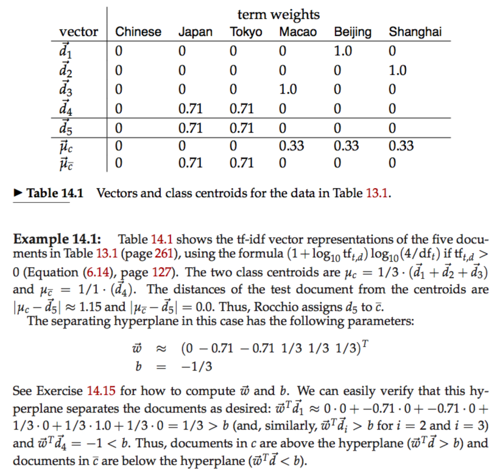
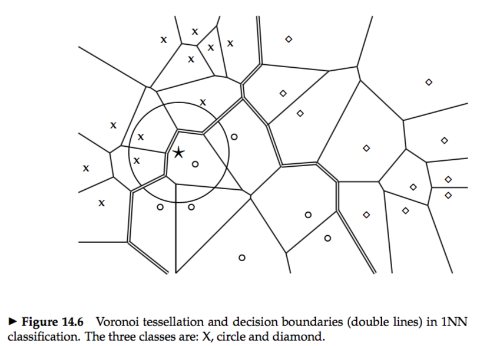
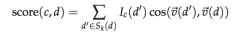
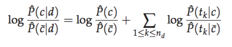
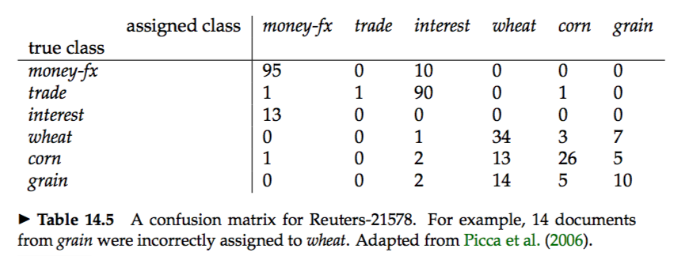



* **Contiguity hypothesis:** Documents in the same class form a contiguous region and regions of different classes do not overlap.  

# 14.1 Document representations and measures of relatedness in vector spaces
# 14.2 Rocchio classification
 
* Rocchio ignores details of the distribution of points in a class and only uses distance from the centroid for classification.  

# 14.3 k nearest neighbor
* **Voronoi tessellation:** The Voronoi tessellation of a set of objects decomposes space into Voronoi cells, where each object’s cell consists of all points that are closer to the object than to other objects.  
 
 

### 14.3.1 Time complexity and optimality of kNN
* kNN simply memorizes all examples in the training set and then compares the test document to them. For this reason, kNN is also called `memory-based learning` or `instance-based learning`.  
* `Bayes error rate:` A measure of the quality of a learning method is its `Bayes error rate`, the average error rate of classifiers learned by it for a particular problem.   

# 14.4 Linear versus nonlinear classifiers
* Rocchio and Naive Bayes are linear classifiers.  
 
* KNN is a nonlinear classifier.  

# 14.5 Classification with more than two classes
* **any-of(multilabel, or multivalue classification):** Classification for classes that are not mutually exclusive is called any-of. In this case, a document can belong to several classes simultaneously, or to a single class, or to none of the classes.  
* **one-of(multinomial, polytomous, multiclass, or single-label classification):** The classes are mutually exclusive. Each document must belong to exactly one of the classes.  
* **confusion matrix:** An important tool for analyzing the performance of a classifier for J > 2 classes is the `confusion matrix`. The confusion matrix shows for each pair of classes ⟨c1, c2⟩, how many documents from c1 were incorrectly assigned to c2.  
 

# 14.6 The bias-variance tradeoff
* Selecting an appropriate learning method is therefore an unavoidable part of solving a text classification problem.  
* The implicit assumption was that training documents and test documents are generated according to the same underlying distribution.  
* We define a classifier γ to be optimal for a distribution P(⟨d, c⟩) if it minimizes MSE(γ).  
* A learning method Γ is optimal for a distribution P(D) if it minimizes the learning error.  
* `Bias` is the squared difference between P(c|d), the true conditional probability of d being in c, and ΓD(d), the prediction of the learned classifier, averaged over training sets.   
* `Variance` is the variation of the prediction of learned classifiers: the average squared difference between ΓD(d) and its average EDΓD(d).   
* We have to weigh the respective merits of bias and variance in our application and choose accordingly. This tradeoff is called the bias-variance tradeoff.  
