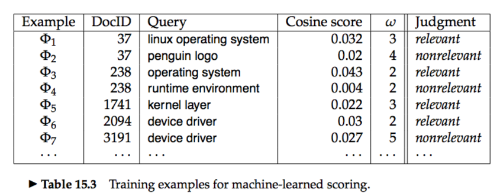


# 15.1 Support vector machines: The linearly separable case
# 15.2 Extensions to the SVM model
# 15.3 Issues in the classification of text documents
* Greater performance gains can be achieved from exploiting domain-specific text features than from changing from one machine learning method to another.  

### 15.3.1 Choosing what kind of classifier to use
* If you have fairly little data and you are going to train a supervised classifier, then machine learning theory says you should stick to a classifier with high bias, such as Naive Bayes.  
* **active learning:** where a system is built which decides which documents a human should label.  

### 15.3.2 Improving classifier performance
##### Large and difficult category taxonomies
* **hierarchical classification**   
* You can always get a small boost in classification accuracy by combining multiple classifiers, provided only that the mistakes that they make are at least somewhat independent.  

##### Features for text
* **feature engineering:** Good feature engineering can often markedly improve the performance of a text classifier.  
* Sometimes all numbers are converted into a single feature, but often some value can be had by distinguishing different kinds of numbers, such as four digit numbers (which are usually years) versus other cardinal numbers versus real numbers with a decimal point. Similar techniques can be applied to dates, ISBN numbers, sports game scores, and so on.  
* it is often useful to increase the number of features by matching parts of words, and by matching selected multiword patterns that are particularly discriminative. **e.g.,**, this would be the case if the keyword ethnic was most indicative of the categories food and arts, the keyword cleansing was most indicative of the category home, but the collocation ethnic cleansing instead indicates the category world news.   
* Overly aggressive stemming can easily degrade classification performance.  

##### Document zones in text classification
1.Upweighting document zones.  
&emsp; * It is often effective to double the weight of title words in text classification problems.   

2.Separate feature spaces for document zones.  
&emsp; * An alternative strategy is to have a completely separate set of features and corresponding parameters for words occurring in different zones.  

3.Connections to text summarization.

# 15.4 Machine learning methods in ad hoc information retrieval
### 15.4.1 A simple example of machine-learned scoring
 

### 15.4.2 Result ranking by machine learning
* **ordinal regression:** Between `classification` and `regression` is the specialized field of `ordinal regression` where a ranking is predicted.  
* **ranking SVM**`skipped for now`
