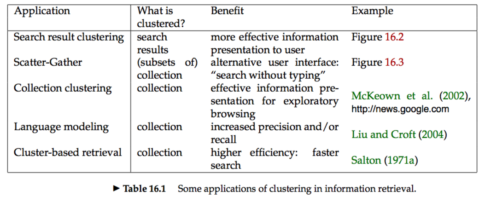
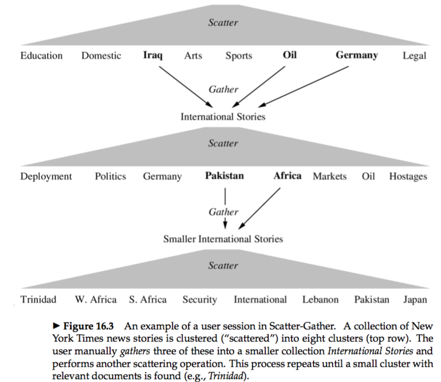


* **flat clustering:** `Flat clustering` creates a flat set of clusters without any explicit structure that would relate clusters to each other.  
* **Hierarchical clustering:** `Hierarchical clustering` creates a hierarchy of clusters.  
* **Hard clustering:** Hard clustering computes a hard assignment – each document is a member of exactly one cluster.  
* * **Soft clustering:** The assignment of soft clustering algorithms is soft – a document’s assignment is a distribution over all clusters.  

# 16.1 Clustering in information retrieval
* **Cluster hypothesis:** Documents in the same cluster behave similarly with respect to relevance to information needs.  
 
* **Scatter-Gather:**
 
* Clustering is well suited for access to a collection of news stories since news reading is not really search, but rather a process of selecting a subset of stories about recent events.  

# 16.2 Problem statement
* **Partitional clustering:** `Partitional clustering` always refers to a clustering where each document belongs to exactly one cluster.   
* Some researchers distinguish between `exhaustive clusterings` that assign each document to a cluster and `non-exhaustive clusterings`, in which some documents will be assigned to no cluster.  

### 16.2.1 Cardinality – the number of clusters
* A difficult issue in clustering is determining the number of clusters or cardi- nality of a clustering, which we denote by K.   

# 16.3 Evaluation of clustering
* **external criterion:** We can then compute an `external criterion` that evaluates how well the clustering matches the gold standard classes.   
* This section introduces four external criteria of clustering quality. `Purity` is a simple and transparent evaluation measure. `Normalized mutual information` can be information-theoretically interpreted. The `Rand index` penalizes both false positive and false negative decisions during clustering. The `F measure` in addition supports differential weighting of these two types of errors.  

# 16.4 K-means

