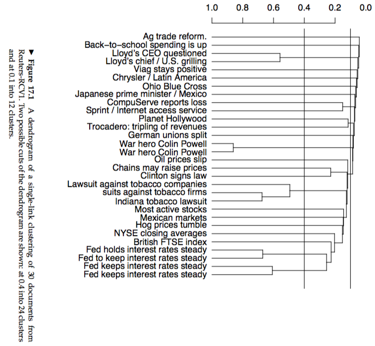
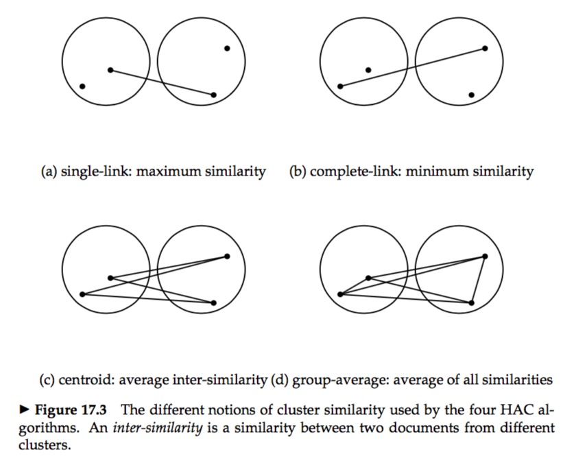
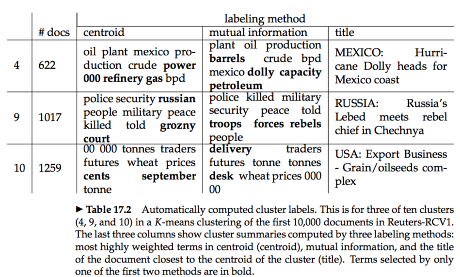



# 17.1 Hierarchical agglomerative clustering
* **hierarchical agglomerative clustering(HAC):** Bottom-up hierarchical clustering is therefore called hierarchical agglomerative clustering or HAC.  
* **dendrogram:**
 
* Sometimes, the hierarchy needs to be cut at some point to get a flat clustering.  
* The four notions of cluster similarity used by HAC:  
 

# 17.2 Single-link and complete-link clustering
* In `single-link clustering` or `single-linkage clustering`, the similarity of two clusters is the similarity of their most similar members.  
* In `complete-link clustering` or `complete-linkage clustering`, the similarity of two clusters is the similarity of their most dissimilar members.  
* **chaining:** Since the merge criterion is strictly local, a chain of points can be extended for long distances without regard to the overall shape of the emerging cluster. This effect is called `chaining`.  
### 17.2.1 Time complexity of HAC

# 17.3 Group-average agglomerative clustering
* `Group-average agglomerative clustering` or `GAAC` evaluates cluster quality based on all similarities between documents.  

# 17.4 Centroid clustering
* In `centroid clustering`, the similarity of two clusters is defined as the similarity of their centroids.  

# 17.5 Optimality of HAC
`skipped for now`  

# 17.6 Divisive clustering
* This variant of hierarchical clustering is called top-down clustering or divisive clustering.  
* There is evidence that divisive algorithms produce more accurate hierarchies than bottom-up algorithms in some circumstances.   

# 17.7 Cluster labeling
 
* **Differential cluster labeling:** `Differential cluster labeling` selects cluster labels by comparing the distribution of terms in one cluster with that of other clusters.  
* **Cluster-internal labeling:** `Cluster-internal labeling` computes a label that solely depends on the cluster itself, not on other clusters.   
* Terms like `year` or `Tuesday` may be among the most frequent in a cluster, but they are not helpful in understanding the contents of a cluster with a specific topic like `oil`.  

# 17.8 Implementation notes
* **Buckshot algorithm:** It combines the determinism and higher reliability of HAC with the efficiency of K-means.  

