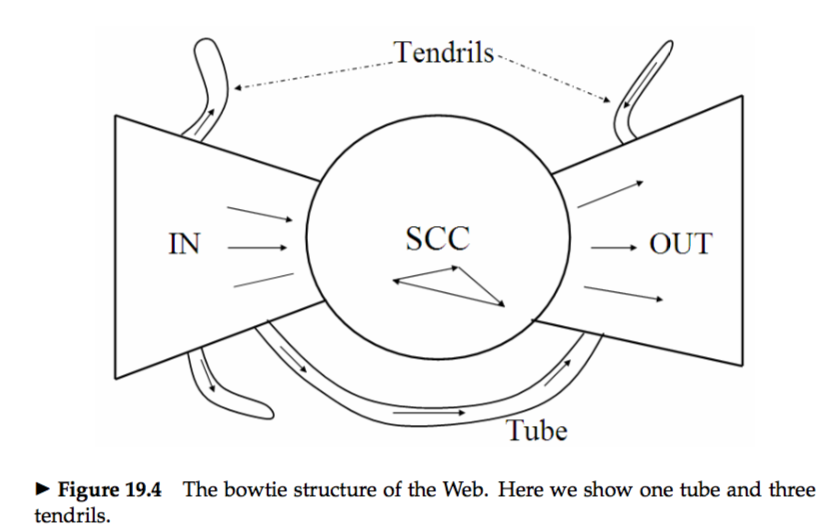


# 19.1 Background and history
# 19.2 Web characteristics
* Static web pages are those whose content does not vary from one request for that page to the next. For this purpose, a professor who manually updates his home page every week is considered to have a static web page, but an airport’s flight status page is considered to be dynamic.  

### 19.2.1 The web graph
* **power law:** the total number of web pages with in-degree i is proportional to 1/iα; the value of α typically reported by studies is 2.1.  
* The directed graph connecting web pages has a `bowtie shape`.The remaining pages form into `tubes` that are small sets of pages outside SCC that lead directly from IN to OUT, and `tendrils` that either lead nowhere from IN, or from nowhere to OUT.   
 

### 19.2.2 Spam
* To avoid irritating users with these repetitions, sophisticated spammers resorted to such tricks as rendering these repeated terms in the same color as the background.  
* In many search engines, it is possible to pay to have one’s web page included in the search engine’s index – a model known as `paid inclusion`.  
* **cloaking:** The spammer’s web server returns different pages depending on whether the http request comes from a web search engine’s crawler, or from a human user’s browser.  
* **doorway page:** A `doorway page` contains text and metadata carefully chosen to rank highly on selected search keywords.   
* **Search Engine Optimizers(SEO):** Provide consultancy services for clients who seek to have their web pages rank highly on selected keywords.  
* **adversarial information retrieval**  
* **link analysis** vs **link spam**  

# 19.3 Advertising as the economic model
* **cost per mil (CPM):** The cost to the company of having its banner advertisement displayed 1000 times.  
* **cost per click (CPC):** By the number of times it was clicked on by the user.   
* **sponsored search** or **search advertising**  
* Current search engines follow precisely this model: they provide pure search results (generally known as `algorithmic search` results) as the primary response to a user’s search, together with `sponsored search` results displayed separately and distinctively to the right of the algorithmic results.  
* **search engine marketing (SEM):** Understanding how search engines do this ranking and how to allocate marketing campaign budgets to different keywords and to different sponsored search engines has become a profession.  
* **click spam:** For instance, a devious advertiser may attempt to exhaust the advertising budget of a competitor by clicking repeatedly (through the use of a robotic click generator) on that competitor’s sponsored search advertisements.  

# 19.4 The search user experience
* Here Google identified two principles that helped it grow at the expense of its competitors:  
&emsp; 1.a focus on relevance, specifically precision rather than recall in the first few results;   
&emsp; 2.a user experience that is lightweight, meaning that both the search query page and the search results page are uncluttered and almost entirely textual, with very few graphical elements.   

### 19.4.1 User query needs
* There appear to be three broad categories into which common web search queries can be grouped: (i) informational, (ii) navigational and (iii) transactional.   
* `Informational queries` seek general information on a broad topic.  
* `Navigational queries` seek the website or home page of a single entity that the user has in mind, say `Lufthansa airlines`.  
* A `transactional query` is one that is a prelude to the user performing a transaction on the Web – such as purchasing a product, downloading a file or making a reservation.  

# 19.5 Index size and estimation
* **capture-recapture method：**The basic hypothesis underlying these techniques is that each search engine indexes a fraction of the Web chosen independently and uniformly at random.  

# 19.6 Near-duplicates and shingling
* **near duplication:** In many cases, the contents of one web page are identical to those of another except for a few characters.  
* **shingling:** Given a positive integer k and a sequence of terms in a document d, define the k-shingles of d to be the set of all consecutive sequences of k terms in d.   
`skipped for now`

 