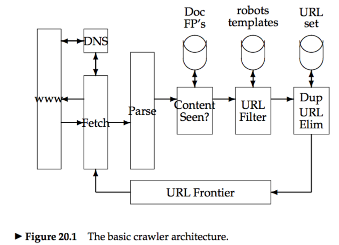


# 20.1 Overview
### 20.1.1 Features a crawler must provide
* **Robustness:** The Web contains servers that create spider traps,which are generators of web pages that mislead crawlers into getting stuck fetching an infinite number of pages in a particular domain.  
* **Politeness**   

### 20.1.2 Features a crawler should provide
* distributed, scalable, performance and efficiency, quality, freshness, extensible

# 20.2 Crawling
* **Mercator:** Mercator crawler has formed the basis of a number of research and commercial crawlers.  
### 20.2.1 Crawler architecture
 

# 20.3 Distributing indexes
# 20.4 Connectivity servers